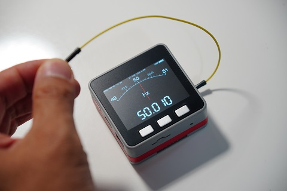
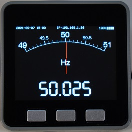
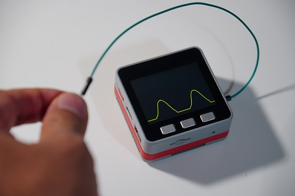
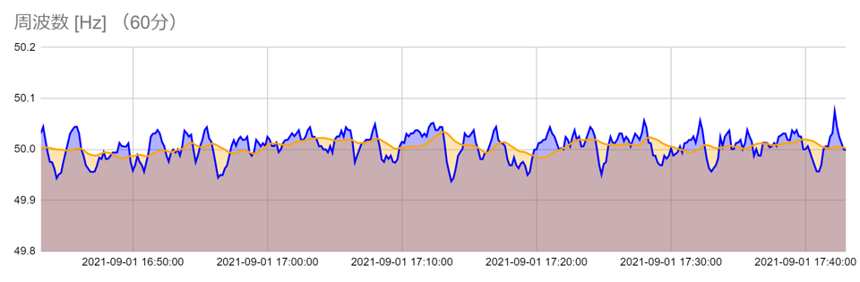

# FreqFloat_M5Stack_Meter
Monitoring and showing mains frequency via floating analog input pin by M5Stack

## Introduction
The mains, AC-grid, or utility frequency is 50 or 60 Hz depending on the region in the world. Here in East Japan, it is 50 Hz. However, this frequency is *not* perfectly constant, but always fluctuating, reflecting the balance between the supply (generation) and demand (load). Monitoring the mains frequency could be fun as you can see it falls in a hot summer day or rises when it is 5 pm as people stop working.

Monitoring the mains frequency needs connection of your microcontroller or computer to the AC grid. There are electrical outlets in a house. They are 100 V in Japan while they could be 240 V in some areas in Europe. Dealing with such an *extremely high voltage* is dangerous for an electronics hobbiest like me. Hmm, how can my M5Stack detect the mains voltage?

If you have used an oscilloscope, you must have been aware of the fact that a floating probe shows a sinusoidal wave induced by the AC grid, especially when a human hand touches the probe. This is, I guess, caused by electrostatic induction to the stray capacitance of the human body with respect to earth.
I decided to utilize this phenomenon to monitor the mains frequency by my M5Stack *without* connecting it to the AC grid.

## How it looks like
The photo below shows when this program is operating in my M5Stack.

One of the analog input pin, which is GPIO35 in the photo, is floating and my hand touches it. The human body creates a signal corresponding to the mains voltage. The M5Stack measures the frequency and displays it as an analog meter together with its digital value.

The photo above shows a close-up of the M5Stack screen. I have also created a program to draw this analog meter to try to make it more attractive. The analog meter is created not only for this frequency monitor, but can be customized for other uses. See AnalogMeter.hpp and AnalogMeter.cpp in this repository for details.

## How it works
Actually, as the A-D converter accepts only positive voltages, the observed voltage looks like a half wave as shown below.

The Arduino sketch measures the time needed to count 50 rising edges (thus, one second if exactly 50 Hz) and calculates the frequency.

## Google Spreadsheet
Just showing the frequency on the LCD is not fun enough. I decided to create a web app on Google Spreadsheet and store the frequency data every ten seconds. Below shows an example graph showing a 60-minute trend of the frequency.

